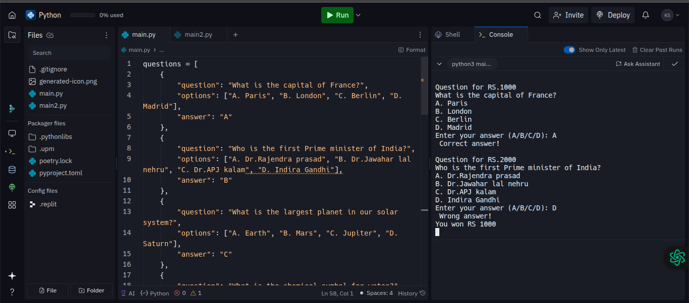
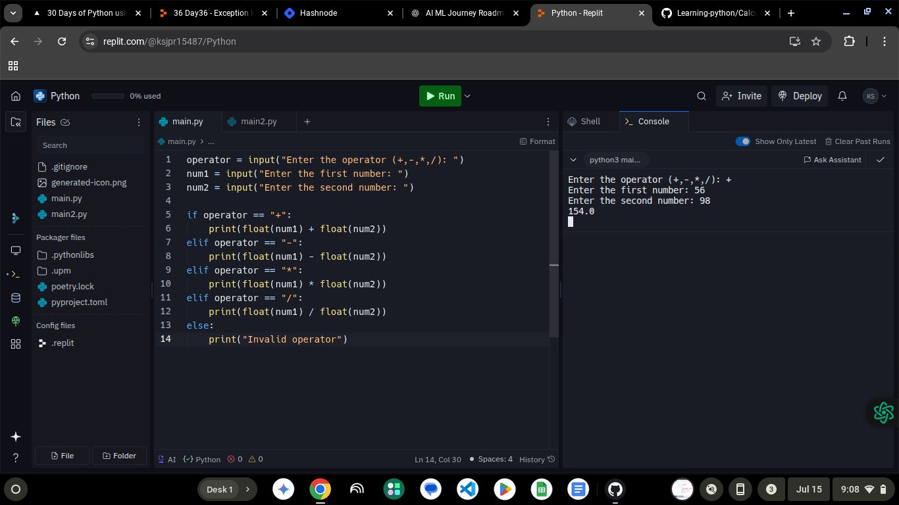

# 🐍 Learning Python – My Beginner Journey

Welcome! This repository documents my journey of learning Python — through notes, code snippets, and beginner-friendly terminal projects.

---

## 📚 Topics I’m Covering

- Variables & Data Types  
- Loops & Conditionals  
- Functions  
- Lists, Tuples, Dictionaries  
- File Handling  
- Object-Oriented Programming  
- Small Projects (Calculator, Number Guessing Game, Quiz Game, etc.)

---

## 🎯 Goal

I'm learning Python to build a solid foundation for:

- Artificial Intelligence (AI)  
- Machine Learning (ML)  
- Deep Learning (DL)  
- Generative AI (GenAI)

📅 **Started**: May 2025  
📌 **Status**: Work in Progress

---

## 🗂️ Projects (So Far)

| Project Name | Description |
|--------------|-------------|
| [`calculator.py`](./calculator.py) | Basic calculator for +, −, ×, ÷ |
| [`guess_game.py`](./guess_game.py) | Number guessing game using the random module |
| [`quiz.py`](./quiz.py) | Terminal-based quiz game with scoring |

---

## 🛠️ How to Run

1. Make sure you have Python 3 installed.  
2. Clone the repo:
```bash
git clone https://github.com/kunallearnsAI/Learning-python.git


## 🖼️ Project Demos

### 🎯 Quiz Game


### 🔢 Number Guessing Game


### ➕ Calculator



